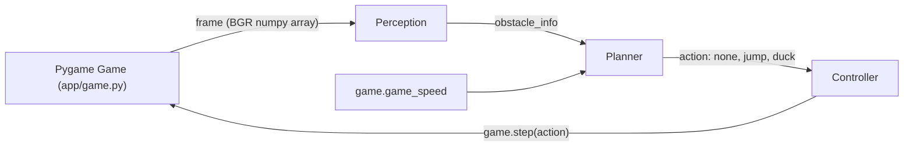
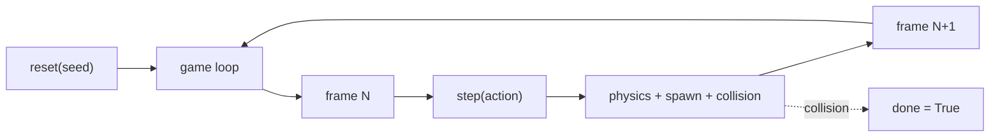

# Chrome Dino Agent: Classical and DL Perception plus Planning

Can a hand-tuned classical pipeline play Chrome Dino at high speeds, and where does it break down before a learned pipeline takes over?

Chrome Dino is a reactive obstacle-avoidance game where a running character jumps over cacti and ducks under pterodactyls while the game speed keeps increasing. Classical computer vision (fixed thresholds, contour detection, and rule-based control) is fast and interpretable but sensitive to hand-picked decision boundaries. We build two versions of the agent in one repository that share a game engine and an evaluation harness: a classical perception plus planner (Vihaan), and a learned DL perception or planner (Anvita). Both versions plug into the same Pygame clone through frozen function signatures and are compared on the same seed list.

On 100 seeded episodes, the classical agent survives every run past frame 5,000 with a mean score of 8,241 (median 8,354, stdev 455). Perception takes 15 microseconds per frame; planning is effectively free. All 100 deaths are timing errors on cacti at game speeds 36 to 44, the point where the linear reaction-distance formula cannot keep up with how far the obstacle moves between frames. The DL version is the comparison point: if a learned agent can handle the speed-scaling problem without per-threshold tuning, that is the contribution.


## Big picture

The agent runs the same loop every frame. It reads the screen as a numpy array, finds the nearest obstacle, decides on one of three actions (nothing, jump, duck), and sends that action back to the game. There is no browser, no screen capture, and no operating system keystrokes. Everything happens through a direct Python API against a self-contained Pygame clone of Chrome Dino.

The classical version hand-codes each step. The DL version replaces perception or planning (or both) with a learned model. Swapping is a single command line flag: `--impl classical` or `--impl dl`. Everything else, including the game engine and the evaluation harness, is shared.


## Repository Structure

```
.
├── main.py                      # watch / batch game loop entry point
├── perception.py                # classical contour detector  (Vihaan)
├── planner.py                   # classical rule-based planner (Vihaan)
├── perception_dl.py             # DL detector  (Anvita, stub)
├── planner_dl.py                # DL planner, defaults to classical (Anvita)
├── requirements.txt
├── app/                         # shared game engine and config
│   ├── game.py                  # ~265 line Pygame clone with pixel sprites
│   ├── controller.py            # action dispatcher
│   └── config.yaml              # all thresholds, crop region, eval settings
├── eval/                        # shared evaluation harness
│   ├── run_eval.py              # batch seeded episodes, per-run JSON logs, summary stats
│   ├── failure_analysis.py      # categorize deaths into 5 buckets
│   ├── summary_100.txt          # latest classical 100-run summary (tracked)
│   └── runs/                    # per-episode JSON logs (gitignored)
├── DL_INTERFACE.md              # frozen signatures both implementations obey
├── TODO_DL.md                   # Anvita's handoff checklist
└── README.md
```

Ownership rule. Each person owns their perception and planner files. Shared code (`app/`, `eval/`, `main.py`, config, docs) requires coordination before editing. When both people need to change shared code at once, work on separate branches and rebase.


## How to Run

Install once:

```bash
pip install -r requirements.txt
```

Watch the agent play one episode in a window:

```bash
python main.py                                  # classical by default
python main.py --impl dl                        # DL pipeline
python main.py --seed 1 --impl classical        # deterministic classical run
python main.py --episodes 5                     # five back to back in the window
```

Batch mode, no window, no FPS cap:

```bash
python main.py --no-render --fast --episodes 100 --impl classical
```

Full eval pipeline (seeded runs, JSON logs, summary, failure categorization):

```bash
python eval/run_eval.py --episodes 100 --impl classical
python eval/run_eval.py --episodes 100 --impl dl
python eval/failure_analysis.py
```

All commands run from the repository root.


## Overall Architecture



Each frame runs the full pipeline. Perception consumes the rendered 600x200 frame, the planner reads the detected obstacle plus the current game speed and emits one of `none`, `jump`, `duck`, and the controller forwards the action. The classical pair of modules (perception.py and planner.py) and the DL pair (perception_dl.py and planner_dl.py) have identical signatures. The `--impl` flag picks which pair to import.


## Game

We built the game ourselves rather than fork an existing clone or screen-scrape the real Chrome Dino. A direct Python API makes perception fast (no operating system round-trip) and the evaluation deterministic (seeded random number generator, fixed speed curve, consistent sprite positions).



Obstacles spawn at 55 to 140 frame intervals, move leftward at the current game speed, and are removed when they go off-screen. Sprites are pixel-art silhouettes composed from ASCII grids at 4x scale. The dino has a two-frame running animation, the pterodactyl flaps its wings, and the ducking pose is a flattened version of the running dino.

| Parameter | Value | Purpose |
|---|---|---|
| `screen_w`, `screen_h` | 600, 200 | frame size |
| `ground_y` | 160 | ground line Y |
| `dino_x`, `dino_w` | 50, 40 | dino position and width |
| `dino_h_stand`, `dino_h_duck` | 40, 20 | standing vs ducking height |
| `gravity`, `jump_v` | 0.8, -14.0 | vertical physics |
| `start_speed`, `speed_inc` | 6.0, 0.004 | initial and per-frame speed increase |
| `spawn_min_gap`, `spawn_max_gap` | 55, 140 | frames between obstacle spawns |
| `cactus_w`, `cactus_h` | 20, 40 | ground obstacle size |
| `ptero_w`, `ptero_h` | 40, 20 | flying obstacle size |
| `ptero_high_y`, `ptero_low_y` | 108, 135 | must-duck and must-jump spawn heights |


## Perception

The perception module looks at one frame at a time, finds the nearest dark shape in front of the dino, and reports what it is (ground cactus or flying pterodactyl) and how far away. It uses fixed image thresholds and contour detection, which makes it fast and deterministic but means the thresholds have to be tuned by hand to the game's visuals.


`perception.detect(frame, cfg)` returns `{present, distance, type, height}` for the nearest obstacle ahead of the dino. Distance is measured from the dino's right edge at x=90 and can be negative when a pterodactyl passes above a ducking dino. We deliberately keep the detection active when distance is negative so the planner stays in `duck` until the threat clears.

The dino itself lives inside the perception crop because we want to keep seeing obstacles that fly over it. The dino's contour is filtered out by a fixed-x-band rule: a ground-touching contour that falls entirely inside `dino_mask_x_start` to `dino_mask_x_end` (45 to 95) is the dino, not an obstacle.

| Config Key | Value | Role |
|---|---|---|
| `crop_x_start`, `crop_x_end` | 50, 500 | horizontal extent of the scan region |
| `crop_y_start`, `crop_y_end` | 80, 160 | vertical extent (excludes the ground line) |
| `threshold` | 150 | grayscale cutoff for dark pixels |
| `min_contour_area` | 50 | noise filter; cactus area is about 800, ptero about 800 |
| `ground_line_y`, `ground_tolerance` | 160, 6 | contour bottom at or below 154 counts as ground |
| `dino_right_edge` | 90 | reference point for distance measurement |
| `dino_mask_x_start`, `dino_mask_x_end` | 45, 95 | band used to drop the dino's own contour |


## Planner

The planner decides what the agent should do, given what perception saw and how fast the game is currently moving. It has no memory between frames and no training data. Every decision is a single if-else rule.

| Obstacle | Obstacle height (top Y) | Distance | Action |
|---|---|---|---|
| none | n/a | n/a | `none` |
| ground (cactus) | n/a | greater than `reaction_distance` | `none` |
| ground (cactus) | n/a | at most `reaction_distance` | `jump` |
| flying (ptero) | greater than `duck_height_threshold`, too low to duck under | at most `reaction_distance` | `jump` |
| flying (ptero) | at most `duck_height_threshold`, high enough to duck under | at most `reaction_distance` | `duck` |

`reaction_distance = base_reaction_distance + speed_factor * game_speed`

| Config Key | Value | Role |
|---|---|---|
| `base_reaction_distance` | 70 | distance threshold at speed = 0 |
| `speed_factor` | 2.0 | linear scaling with game speed |
| `duck_height_threshold` | 125 | flying obstacles with top Y above this are duckable |

A pterodactyl spawned at Y=108 has its bottom at Y=128, which is above the ducking dino's top at Y=140, so the planner picks `duck`. A pterodactyl at Y=135 has its bottom at Y=155, which collides with both standing and ducking dino, so the planner picks `jump`.


## Evaluation Protocol

We run 100 deterministic games with fixed seeds and measure how long the agent survives, what kills it, and how much time the pipeline spends per frame. The same harness runs the DL implementation later so the numbers are directly comparable.

Determinism comes from three places: the game uses a seeded `random.Random`, the agent reads the rendered frame through `surfarray` (same pixels every time), and perception plus planner are pure functions. Seed N produces the same score every run. Any DL-specific configuration lives under a `dl:` section in `config.yaml` so neither implementation can disturb the other's thresholds.

| Parameter | Value |
|---|---|
| Episodes | 100 |
| Seeds | rotated through `[1, 2, 3, 4, 5]` for 20 cohorts |
| Max frames per episode | 10,000 (frame cap prevents infinite runs when the agent is too good for the difficulty) |
| Headless | yes (pygame dummy video driver) |
| Fast mode | yes (no FPS cap) |

Each episode writes a JSON log to `eval/runs/run_<impl>_<seed>_<i>.json`. Logs include frame-by-frame action, obstacle info, dino state, and the raw obstacle list so later analysis does not need to rerun the game. `failure_analysis.py` reads every log in `eval/runs/` and classifies each death into one of five buckets: `survived`, `missed_detection`, `misclassification`, `late_reaction`, `timing_error`.


## Results

Scores cluster by the game speed the agent was playing at when it died. Every run hits the agent's timing limit eventually, and the seed determines how many obstacles happen to arrive before that limit is reached. Perception is never the failure; the planner's reaction distance is.

### Score and survival

| Metric | Mean | Median | Min | Max | Stdev |
|---|---|---|---|---|---|
| Score (frames survived) | 8,241.5 | 8,354 | 7,616 | 9,441 | 454.6 |
| Obstacles cleared | 83.6 | 84 | 72 | 98 | 5.4 |
| Final game speed | 38.97 | n/a | 36.46 | 43.76 | n/a |

| Score percentile | p10 | p25 | p50 | p75 | p90 | p95 |
|---|---|---|---|---|---|---|
| Value | 7,631 | 7,654 | 8,354 | 8,425 | 8,494 | 9,259 |

| Threshold | Percent of runs reaching it |
|---|---|
| 1,000 frames | 100.0% |
| 5,000 frames | 100.0% |
| 10,000 frames (the cap) | 0.0% |

### Death cause

Every single death is a cactus. Pterodactyls are detected and avoided reliably at every speed the agent plays at. This is useful for the DL comparison: if a DL perception module gets any pterodactyl death, it has to justify why a more expensive model lost ground on the easier case.

| Type | Count | Fraction |
|---|---|---|
| Ground (cactus) | 100 | 100.0% |
| Flying (pterodactyl) | 0 | 0.0% |

### Failure analysis

| Category | Count | Fraction |
|---|---|---|
| survived | 0 | 0.0% |
| missed_detection | 0 | 0.0% |
| misclassification | 0 | 0.0% |
| late_reaction | 0 | 0.0% |
| timing_error | 100 | 100.0% |

### Per-frame latency

| Stage | Time |
|---|---|
| Perception | 0.015 ms per frame (about 15 microseconds) |
| Planning | under 0.001 ms per frame |


## Why the agent plateaus

The failure mode is simple to state. The planner tells the dino to jump when the obstacle is at most `70 + 2.0 * game_speed` pixels away. At game speed 36.5, that threshold is 143 pixels. But each frame the obstacle moves 36.5 pixels closer. So the observed distance steps from about 145 (no jump) to about 109 (jump) in one frame, and by the time the jump takes effect the obstacle is too close to clear.

This shows up as three speed cliffs in the data. Seeds that get a cactus right at the first cliff die at score around 7,620. Seeds that slip past it die at the next cliff at score around 8,350. A small fraction make it past even that and die around 9,200.

| Death-speed cohort | Runs | Typical score |
|---|---|---|
| 36 to 37 | 29 | 7,616 to 7,659 |
| 39 to 40 | 63 | 8,320 to 8,495 |
| 42 to 44 | 8 | 9,146 to 9,441 |

The fix is a config change, not a code change: raising `planner.speed_factor` from 2.0 to something like 4.0 or 6.0 pushes the jump threshold past the per-frame displacement at those speeds. We keep the value tight on purpose so the eval shows a real, categorizable failure instead of a flat 100% cap-reach that would hide the pipeline's behavior.

This is the point of comparison for the DL version. A learned agent that handles the speed-scaling problem without this hand-picked knob is a real contribution. A DL agent that only matches the classical mean score of 8,241 on the same seeds is a legitimate finding too; it means the classical rules captured what this game rewards.


## DL Handoff

The DL code lives in the same repository. Anvita owns `perception_dl.py` and `planner_dl.py`. Currently they are stubs: `perception_dl.detect` raises `NotImplementedError` with a pointer to the docs, and `planner_dl.decide` delegates to the classical planner so a DL perception change can be tested on its own.

Both files must obey the frozen contract in `DL_INTERFACE.md`:

```
perception.detect(frame, cfg) returns
  {'present': bool, 'distance': int or None, 'type': 'ground' | 'flying' | None, 'height': int or None}

planner.decide(obstacle_info, game_speed, cfg) returns 'none' | 'jump' | 'duck'
```

Any DL-specific configuration (model path, input size, device) goes under a new `dl:` section in `app/config.yaml`. Do not change existing keys. The rest of the pipeline (game engine, controller, eval harness) is shared and should not be edited without coordination.

The concrete checklist, suggested approaches, and eval parity requirements are in `TODO_DL.md`.


## Team

Vihaan Manchanda (classical), Anvita Suresh (DL)

IDS 705, Duke University


## References

- Project specification: `CLAUDE.md` at repository root.
- DL interface contract: `DL_INTERFACE.md`.
- DL handoff checklist: `TODO_DL.md`.
- Latest classical eval summary: `eval/summary_100.txt`.
