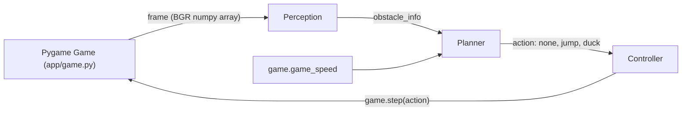
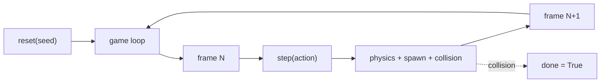

# Chrome Dino Agent: Classical and DL Perception plus Planning

Can a hand-tuned classical pipeline play Chrome Dino at high speeds, and where does it break down before a learned pipeline takes over?

Chrome Dino is a reactive obstacle-avoidance game where a running character jumps over cacti and ducks under pterodactyls while the game speed keeps increasing. Classical computer vision (fixed thresholds, contour detection, and rule-based control) is fast and interpretable but sensitive to hand-picked decision boundaries. We build two versions of the agent in one repository that share a game engine and an evaluation harness: a classical perception plus planner (Vihaan), and a learned DL perception or planner (Anvita). The game also spawns cloud-shaped decoys that classical perception cannot distinguish from real obstacles, so wasted jumps create compounding failures at high speed. Both versions plug into the same Pygame clone through frozen function signatures and are compared on the same seed list.

On 100 seeded episodes with decoys enabled, the classical agent scores a mean of 1,784 (median 1,156, stdev 1,882). Only 8 percent of runs reach 5,000 frames; 67 percent of deaths are cacti and 33 percent are pterodactyls catching the dino while it is mid-recovery from a cloud-induced jump. 47 percent of failures categorize as misclassification (clouds tagged as cacti), 53 percent as timing errors. Perception still runs in 16 microseconds per frame, but speed is no longer the bottleneck. The DL version is the comparison point: if a learned perception module can learn to ignore clouds from labeled data, its score should stay near the clean-game classical ceiling of about 8,200 while our classical agent collapses to 1,784.


## Big picture

The agent runs the same loop every frame. It reads the screen as a numpy array, finds the nearest obstacle, decides on one of three actions (nothing, jump, duck), and sends that action back to the game. There is no browser, no screen capture, and no operating system keystrokes. Everything happens through a direct Python API against a self-contained Pygame clone of Chrome Dino.

The classical version hand-codes each step. The DL version replaces perception or planning (or both) with a learned model. Swapping is a single command line flag: `--impl classical` or `--impl dl`. Everything else, including the game engine and the evaluation harness, is shared.


## Repository Structure

```
.
├── main.py                      # watch / batch game loop entry point
├── perception.py                # classical contour detector  (Vihaan)
├── planner.py                   # classical rule-based planner (Vihaan)
├── perception_dl.py             # DL detector  (Anvita, stub)
├── planner_dl.py                # DL planner, defaults to classical (Anvita)
├── requirements.txt
├── app/                         # shared game engine and config
│   ├── game.py                  # ~265 line Pygame clone with pixel sprites
│   ├── controller.py            # action dispatcher
│   └── config.yaml              # all thresholds, crop region, eval settings
├── eval/                        # shared evaluation harness
│   ├── run_eval.py              # batch seeded episodes, per-run JSON logs, summary stats
│   ├── failure_analysis.py      # categorize deaths into 5 buckets
│   ├── summary_100.txt          # latest classical 100-run summary (tracked)
│   └── runs/                    # per-episode JSON logs (gitignored)
├── DL_INTERFACE.md              # frozen signatures both implementations obey
├── TODO_DL.md                   # Anvita's handoff checklist
└── README.md
```

Ownership rule. Each person owns their perception and planner files. Shared code (`app/`, `eval/`, `main.py`, config, docs) requires coordination before editing. When both people need to change shared code at once, work on separate branches and rebase.


## How to Run

Install once:

```bash
pip install -r requirements.txt
```

Watch the agent play one episode in a window:

```bash
python main.py                                  # classical by default
python main.py --impl dl                        # DL pipeline
python main.py --seed 1 --impl classical        # deterministic classical run
python main.py --episodes 5                     # five back to back in the window
```

Batch mode, no window, no FPS cap:

```bash
python main.py --no-render --fast --episodes 100 --impl classical
```

Full eval pipeline (seeded runs, JSON logs, summary, failure categorization):

```bash
python eval/run_eval.py --episodes 100 --impl classical
python eval/run_eval.py --episodes 100 --impl dl
python eval/failure_analysis.py
```

All commands run from the repository root.


## Overall Architecture



Each frame runs the full pipeline. Perception consumes the rendered 600x200 frame, the planner reads the detected obstacle plus the current game speed and emits one of `none`, `jump`, `duck`, and the controller forwards the action. The classical pair of modules (perception.py and planner.py) and the DL pair (perception_dl.py and planner_dl.py) have identical signatures. The `--impl` flag picks which pair to import.


## Game

We built the game ourselves rather than fork an existing clone or screen-scrape the real Chrome Dino. A direct Python API makes perception fast (no operating system round-trip) and the evaluation deterministic (seeded random number generator, fixed speed curve, consistent sprite positions).



Obstacles spawn at 55 to 140 frame intervals, move leftward at the current game speed, and are removed when they go off-screen. Sprites are pixel-art silhouettes composed from ASCII grids at 4x scale. The dino has a two-frame running animation, the pterodactyl flaps its wings, and the ducking pose is a flattened version of the running dino.

The game also spawns cloud-shaped decoys on their own timer (every 160 to 340 frames). Clouds are drawn as dark silhouettes at a cactus-like Y position, so a classical contour detector classifies them as ground obstacles. They pass through the dino with no collision. This is the visual complication the DL version is designed to handle: the clouds and the real cacti are visually similar but only one of them matters for collision, and classical perception has no way to tell them apart from silhouette alone.

| Parameter | Value | Purpose |
|---|---|---|
| `screen_w`, `screen_h` | 600, 200 | frame size |
| `ground_y` | 160 | ground line Y |
| `dino_x`, `dino_w` | 50, 40 | dino position and width |
| `dino_h_stand`, `dino_h_duck` | 40, 20 | standing vs ducking height |
| `gravity`, `jump_v` | 0.8, -14.0 | vertical physics |
| `start_speed`, `speed_inc` | 6.0, 0.004 | initial and per-frame speed increase |
| `spawn_min_gap`, `spawn_max_gap` | 55, 140 | frames between real-obstacle spawns |
| `cactus_w`, `cactus_h` | 20, 40 | ground obstacle size |
| `ptero_w`, `ptero_h` | 40, 20 | flying obstacle size |
| `ptero_high_y`, `ptero_low_y` | 108, 135 | must-duck and must-jump spawn heights |
| `cloud_w`, `cloud_h`, `cloud_y` | 48, 20, 135 | decoy size and spawn Y (bottom at 155, classical reads as ground) |
| `spawn_cloud_min`, `spawn_cloud_max` | 160, 340 | frames between decoy spawns (roughly one cloud per two real obstacles) |


## Perception

The perception module looks at one frame at a time, finds the nearest dark shape in front of the dino, and reports what it is (ground cactus or flying pterodactyl) and how far away. It uses fixed image thresholds and contour detection, which makes it fast and deterministic but means the thresholds have to be tuned by hand to the game's visuals.


`perception.detect(frame, cfg)` returns `{present, distance, type, height}` for the nearest obstacle ahead of the dino. Distance is measured from the dino's right edge at x=90 and can be negative when a pterodactyl passes above a ducking dino. We deliberately keep the detection active when distance is negative so the planner stays in `duck` until the threat clears.

The dino itself lives inside the perception crop because we want to keep seeing obstacles that fly over it. The dino's contour is filtered out by a fixed-x-band rule: a ground-touching contour that falls entirely inside `dino_mask_x_start` to `dino_mask_x_end` (45 to 95) is the dino, not an obstacle.

| Config Key | Value | Role |
|---|---|---|
| `crop_x_start`, `crop_x_end` | 50, 500 | horizontal extent of the scan region |
| `crop_y_start`, `crop_y_end` | 80, 160 | vertical extent (excludes the ground line) |
| `threshold` | 150 | grayscale cutoff for dark pixels |
| `min_contour_area` | 50 | noise filter; cactus area is about 800, ptero about 800 |
| `ground_line_y`, `ground_tolerance` | 160, 6 | contour bottom at or below 154 counts as ground |
| `dino_right_edge` | 90 | reference point for distance measurement |
| `dino_mask_x_start`, `dino_mask_x_end` | 45, 95 | band used to drop the dino's own contour |


## Planner

The planner decides what the agent should do, given what perception saw and how fast the game is currently moving. It has no memory between frames and no training data. Every decision is a single if-else rule.

| Obstacle | Obstacle height (top Y) | Distance | Action |
|---|---|---|---|
| none | n/a | n/a | `none` |
| ground (cactus) | n/a | greater than `reaction_distance` | `none` |
| ground (cactus) | n/a | at most `reaction_distance` | `jump` |
| flying (ptero) | greater than `duck_height_threshold`, too low to duck under | at most `reaction_distance` | `jump` |
| flying (ptero) | at most `duck_height_threshold`, high enough to duck under | at most `reaction_distance` | `duck` |

`reaction_distance = base_reaction_distance + speed_factor * game_speed`

| Config Key | Value | Role |
|---|---|---|
| `base_reaction_distance` | 70 | distance threshold at speed = 0 |
| `speed_factor` | 2.0 | linear scaling with game speed |
| `duck_height_threshold` | 125 | flying obstacles with top Y above this are duckable |

A pterodactyl spawned at Y=108 has its bottom at Y=128, which is above the ducking dino's top at Y=140, so the planner picks `duck`. A pterodactyl at Y=135 has its bottom at Y=155, which collides with both standing and ducking dino, so the planner picks `jump`.


## Evaluation Protocol

We run 100 deterministic games with fixed seeds and measure how long the agent survives, what kills it, and how much time the pipeline spends per frame. The same harness runs the DL implementation later so the numbers are directly comparable.

Determinism comes from three places: the game uses a seeded `random.Random`, the agent reads the rendered frame through `surfarray` (same pixels every time), and perception plus planner are pure functions. Seed N produces the same score every run. Any DL-specific configuration lives under a `dl:` section in `config.yaml` so neither implementation can disturb the other's thresholds.

| Parameter | Value |
|---|---|
| Episodes | 100 |
| Seeds | rotated through `[1, 2, 3, 4, 5]` for 20 cohorts |
| Max frames per episode | 10,000 (frame cap prevents infinite runs when the agent is too good for the difficulty) |
| Headless | yes (pygame dummy video driver) |
| Fast mode | yes (no FPS cap) |

Each episode writes a JSON log to `eval/runs/run_<impl>_<seed>_<i>.json`. Logs include frame-by-frame action, obstacle info, dino state, and the raw obstacle list so later analysis does not need to rerun the game. `failure_analysis.py` reads every log in `eval/runs/` and classifies each death into one of five buckets: `survived`, `missed_detection`, `misclassification`, `late_reaction`, `timing_error`.


## Classical Results

Scores are highly variable with decoys turned on. Classical perception cannot tell a cloud from a cactus, so the agent jumps on clouds; jumps commit the dino to 35 airborne frames, and if a real obstacle arrives during that window the dino lands on it. Earlier runs that would have hit the speed-36 cliff now die much earlier because cloud-induced jumps bring the crash point forward.

### Score and survival

| Metric | Mean | Median | Min | Max | Stdev |
|---|---|---|---|---|---|
| Score (frames survived) | 1,783.8 | 1,156 | 281 | 8,637 | 1,882.1 |
| Obstacles cleared | 17.0 | 10 | 1 | 88 | 19.9 |
| Final game speed | n/a | n/a | 7.12 | 40.54 | n/a |

| Score percentile | p10 | p25 | p50 | p75 | p90 | p95 |
|---|---|---|---|---|---|---|
| Value | 348 | 548 | 1,156 | 2,309 | 4,761 | 6,621 |

| Threshold | Percent of runs reaching it |
|---|---|
| 1,000 frames | 54.0% |
| 5,000 frames | 8.0% |
| 10,000 frames (the cap) | 0.0% |

### Death cause

Deaths are no longer a single failure mode. A third of them are now pterodactyls, which happens when the agent is recovering from a cloud-induced jump and a real ptero arrives before the dino can act again. This is a regression from the pre-decoy version where 100 percent of deaths were cacti and pterodactyls were handled perfectly.

| Type | Count | Fraction |
|---|---|---|
| Ground (cactus) | 67 | 67.0% |
| Flying (pterodactyl) | 33 | 33.0% |

### Failure analysis

The failure analysis now shows two roughly equal failure modes. `misclassification` catches frames where classical perception reports a type that differs from what the game internally tagged, which is exactly what clouds cause (perception says ground, game says decoy). `timing_error` catches frames where the agent acted on a real obstacle but still collided, usually because a previous cloud-induced jump had not yet fully resolved.

| Category | Count | Fraction |
|---|---|---|
| survived | 0 | 0.0% |
| missed_detection | 0 | 0.0% |
| misclassification | 47 | 47.0% |
| late_reaction | 0 | 0.0% |
| timing_error | 53 | 53.0% |

### Per-frame latency

| Stage | Time |
|---|---|
| Perception | 0.016 ms per frame (about 16 microseconds) |
| Planning | under 0.001 ms per frame |


## Why the classical agent plateaus

The failure mode has two flavors now, and the second is the interesting one.

The first flavor is the same as before decoys: at high game speeds the linear reaction distance (`70 + 2.0 * game_speed`) stops being large enough given how far an obstacle moves per frame. Raising `planner.speed_factor` from 2.0 to something like 4.0 or 6.0 fixes it. We still keep the value tight on purpose so the eval shows real, categorizable failures.

The second flavor is the decoy response. Classical perception finds any dark blob above a certain size in the crop region and classifies it by position: contour bottom at or below Y=154 is a ground obstacle, anything higher is flying. Cloud decoys are drawn at Y=135 with height 20, putting their bottom at Y=155. From classical's perspective they are indistinguishable from cacti. The planner jumps. The jump commits the dino to 35 airborne frames. If a real obstacle arrives during that window, the dino has no way to react, and collision happens either in the air (flying obstacle) or at the moment of landing (ground obstacle). This is why 33 percent of deaths are now pterodactyls and why the median score collapsed from 8,354 to 1,156.

Classical can patch this with another rule. For example, size-filter: clouds are 48 pixels wide, cacti are 20 pixels wide; treat wide dark blobs as decoys. That works until we change the cloud sprite, or add a new obstacle type, or let the clouds overlap with cacti in the frame. Every patch adds another brittle threshold.

This is the point of comparison for the DL version. A learned perception module trained on frames where clouds are labeled as non-obstacles should be able to ignore them without a separate rule. If the DL mean score stays near the pre-decoy classical ceiling of about 8,200 while our classical agent collapses to 1,784, the delta is the real contribution of learning.


## DL Handoff

The DL code lives in the same repository. Anvita owns `perception_dl.py` and `planner_dl.py`. Currently they are stubs: `perception_dl.detect` raises `NotImplementedError` with a pointer to the docs, and `planner_dl.decide` delegates to the classical planner so a DL perception change can be tested on its own.

Both files must obey the frozen contract in `DL_INTERFACE.md`:

```
perception.detect(frame, cfg) returns
  {'present': bool, 'distance': int or None, 'type': 'ground' | 'flying' | None, 'height': int or None}

planner.decide(obstacle_info, game_speed, cfg) returns 'none' | 'jump' | 'duck'
```

Any DL-specific configuration (model path, input size, device) goes under a new `dl:` section in `app/config.yaml`. Do not change existing keys. The rest of the pipeline (game engine, controller, eval harness) is shared and should not be edited without coordination.

The concrete checklist, suggested approaches, and eval parity requirements are in `TODO_DL.md`.


## DL Results

Pending. Anvita runs `python eval/run_eval.py --episodes 100 --impl dl` once `perception_dl.py` is implemented. The tables below are the slots she fills in, using the same seeds and the same `max_frames` cap as the classical eval.

### DL score and survival

| Metric | Mean | Median | Min | Max | Stdev |
|---|---|---|---|---|---|
| Score (frames survived) | TBD | TBD | TBD | TBD | TBD |
| Obstacles cleared | TBD | TBD | TBD | TBD | TBD |
| Final game speed | TBD | n/a | TBD | TBD | n/a |

| Score percentile | p10 | p25 | p50 | p75 | p90 | p95 |
|---|---|---|---|---|---|---|
| Value | TBD | TBD | TBD | TBD | TBD | TBD |

| Threshold | Percent of runs reaching it |
|---|---|
| 1,000 frames | TBD |
| 5,000 frames | TBD |
| 10,000 frames (the cap) | TBD |

### DL death cause

| Type | Count | Fraction |
|---|---|---|
| Ground (cactus) | TBD | TBD |
| Flying (pterodactyl) | TBD | TBD |

### DL failure analysis

| Category | Count | Fraction |
|---|---|---|
| survived | TBD | TBD |
| missed_detection | TBD | TBD |
| misclassification | TBD | TBD |
| late_reaction | TBD | TBD |
| timing_error | TBD | TBD |

### DL per-frame latency

| Stage | Time |
|---|---|
| Perception | TBD ms per frame |
| Planning | TBD ms per frame |

### Which parts of the pipeline are learned

| Module | Implementation |
|---|---|
| Perception | TBD (CNN, YOLO, VLM, or unchanged from classical) |
| Planner | TBD (learned policy or unchanged from classical) |
| Config keys added under `dl:` | TBD |


## Classical vs DL Comparison

Pending. Populated after the DL run lands. Same seeds, same max_frames, same game.

| Metric | Classical | DL | Delta |
|---|---|---|---|
| Mean score | 1,784 | TBD | TBD |
| Median score | 1,156 | TBD | TBD |
| Stdev | 1,882 | TBD | TBD |
| Percent reaching 1,000 | 54.0% | TBD | TBD |
| Percent reaching 5,000 | 8.0% | TBD | TBD |
| Percent reaching cap | 0.0% | TBD | TBD |
| Ground deaths | 67.0% | TBD | TBD |
| Flying deaths | 33.0% | TBD | TBD |
| Misclassification failures | 47.0% | TBD | TBD |
| Timing-error failures | 53.0% | TBD | TBD |
| Perception latency | 0.016 ms | TBD | TBD |
| Planning latency | under 0.001 ms | TBD | TBD |

### Short analysis

Pending. Two paragraphs at most:

First paragraph. Where did DL beat classical and why. If the answer is "learned perception ignored clouds, score recovered toward the pre-decoy ceiling," say so concretely with numbers.

Second paragraph. Where did DL lose to classical and why. Common reasons: slower inference eating into reaction time; model trained on too few frames; specific failure modes the model did not see during training.

A DL result that only matches classical is still a legitimate finding. Write it honestly.


## Team

Vihaan Manchanda (classical), Anvita Suresh (DL)

IDS 705, Duke University


## References

- Project specification: `CLAUDE.md` at repository root.
- DL interface contract: `DL_INTERFACE.md`.
- DL handoff checklist: `TODO_DL.md`.
- Classical eval summary: `eval/summary_100.txt`.
- DL eval summary (pending): `eval/summary_100_dl.txt`.
