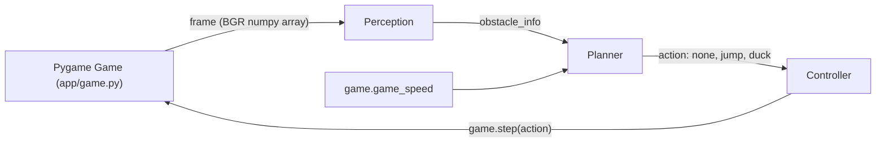
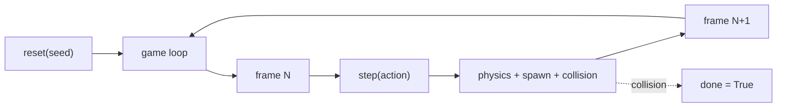

# Chrome Dino Agent: Classical and DL Perception plus Planning

Can a hand-tuned classical pipeline play Chrome Dino at high speeds, and where does it break down before a learned pipeline takes over?

Chrome Dino is a reactive obstacle-avoidance game where a running character jumps over cacti and ducks under pterodactyls while the game speed keeps increasing. Classical computer vision (fixed thresholds, contour detection, and rule-based control) is fast and interpretable but sensitive to hand-picked decision boundaries. We build two versions of the agent in one repository that share a game engine and an evaluation harness: a classical perception plus planner, and a learned DL perception. The game also spawns light-blue cloud-shaped decoys at random Y positions. The clouds look visibly different from cacti to a human but a fixed-threshold contour detector still picks them up as dark shapes, so classical is forced to act on them. Both versions plug into the same Pygame clone through frozen function signatures and are compared on the same seed list.

On 100 seeded episodes, the classical agent scores a mean of 2,511 (median 1,302, stdev 2,501); only 16 percent of runs reach 5,000 frames and zero reach the 10,000-frame cap. The DL version replaces perception with a two-stage pipeline: classical contour detection proposes candidate bounding boxes, and a small 3-class CNN labels each patch as ground obstacle, flying obstacle, or decoy. Over the same 100 seeded episodes it scores a mean of 4,869 (median 5,253), with 50 percent of runs reaching 5,000 frames. Misclassification failures drop from 57 percent to 4 percent, confirming that the learned classifier suppresses cloud decoys near-perfectly. The remaining gap to the pre-decoy classical ceiling of about 8,200 is split between timing errors at high speed (57 percent of failures) and missed detections inherited from the classical contour stage (39 percent). DL perception runs at 0.181 ms per frame, 10x classical, still well inside the 16 ms budget a 60 fps game allows.


## Big picture

The agent runs the same loop every frame. It reads the screen as a numpy array, finds the nearest obstacle, decides on one of three actions (nothing, jump, duck), and sends that action back to the game. There is no browser, no screen capture, and no operating system keystrokes. Everything happens through a direct Python API against a self-contained Pygame clone of Chrome Dino.

The classical version hand-codes each step. The DL version replaces perception or planning (or both) with a learned model. Swapping is a single command line flag: `--impl classical` or `--impl dl`. Everything else, including the game engine and the evaluation harness, is shared.


## Repository Structure

```
.
├── main.py                      # watch / batch game loop entry point
├── perception.py                # classical contour detector
├── planner.py                   # classical rule-based planner
├── perception_dl.py             # DL detector (CNN classifier on contour bboxes)
├── planner_dl.py                # DL planner (defaults to classical)
├── model_dl.py                  # CNN definition shared by training and inference
├── train_perception_dl.py       # data collection + CNN training script
├── weights/                     # trained model weights (cnn.pt)
├── requirements.txt
├── app/                         # game engine and config
│   ├── game.py                  # Pygame clone with pixel sprites
│   ├── controller.py            # action dispatcher
│   └── config.yaml              # all thresholds, crop region, eval settings
├── eval/                        # evaluation harness
│   ├── run_eval.py              # batch seeded episodes, per-run JSON logs, summary stats
│   ├── failure_analysis.py      # categorize deaths into 5 buckets
│   ├── summary_100.txt          # latest classical 100-run summary (tracked)
│   └── runs/                    # per-episode JSON logs (gitignored)
├── DL_INTERFACE.md              # frozen signatures both implementations obey
├── TODO_DL.md                   # DL implementation checklist
└── README.md
```

Ownership rule. Each person owns their perception and planner files. Shared code (`app/`, `eval/`, `main.py`, config, docs) requires coordination before editing. When both people need to change shared code at once, work on separate branches and rebase.


## How to Run

Install once:

```bash
pip install -r requirements.txt
```

Watch the agent play one episode in a window:

```bash
python main.py                                  # classical by default
python main.py --impl dl                        # DL pipeline
python main.py --seed 1 --impl classical        # deterministic classical run
python main.py --episodes 5                     # five back to back in the window
```

Batch mode, no window, no FPS cap:

```bash
python main.py --no-render --fast --episodes 100 --impl classical
```

Full eval pipeline (seeded runs, JSON logs, summary, failure categorization):

```bash
python eval/run_eval.py --episodes 100 --impl classical
python eval/run_eval.py --episodes 100 --impl dl
python eval/failure_analysis.py
```

All commands run from the repository root.


## Overall Architecture



Each frame runs the full pipeline. Perception consumes the rendered 600x200 frame, the planner reads the detected obstacle plus the current game speed and emits one of `none`, `jump`, `duck`, and the controller forwards the action. The classical pair of modules (perception.py and planner.py) and the DL pair (perception_dl.py and planner_dl.py) have identical signatures. The `--impl` flag picks which pair to import.


## Game

We built the game ourselves rather than fork an existing clone or screen-scrape the real Chrome Dino. A direct Python API makes perception fast (no operating system round-trip) and the evaluation deterministic (seeded random number generator, fixed speed curve, consistent sprite positions).



Obstacles spawn at 55 to 140 frame intervals, move leftward at the current game speed, and are removed when they go off-screen. Sprites are pixel-art silhouettes composed from ASCII grids at 4x scale. The dino has a two-frame running animation, the pterodactyl flaps its wings, and the ducking pose is a flattened version of the running dino.

The game also spawns light-blue fluffy cloud decoys on their own timer (every 160 to 340 frames). Each cloud appears at a random Y in the range 85 to 135, so its effect on classical depends on where it spawns: at ground Y it looks like a cactus and classical jumps, at ptero-high Y it looks like a flying obstacle and classical ducks. The cloud is visually obvious to a human (light blue, cloud-shaped, very different from a dark cactus), but the classical contour detector works on a fixed brightness threshold so it sees the cloud as another dark silhouette and acts on it. This is the visual complication the DL version is designed to handle.

| Parameter | Value | Purpose |
|---|---|---|
| `screen_w`, `screen_h` | 600, 200 | frame size |
| `ground_y` | 160 | ground line Y |
| `dino_x`, `dino_w` | 50, 40 | dino position and width |
| `dino_h_stand`, `dino_h_duck` | 40, 20 | standing vs ducking height |
| `gravity`, `jump_v` | 0.8, -14.0 | vertical physics |
| `start_speed`, `speed_inc` | 6.0, 0.004 | initial and per-frame speed increase |
| `spawn_min_gap`, `spawn_max_gap` | 55, 140 | frames between real-obstacle spawns |
| `cactus_w`, `cactus_h` | 20, 40 | ground obstacle size |
| `ptero_w`, `ptero_h` | 40, 20 | flying obstacle size |
| `ptero_high_y`, `ptero_low_y` | 108, 135 | must-duck and must-jump spawn heights |
| `cloud_w`, `cloud_h` | 56, 24 | decoy size (fluffy shape, light blue) |
| `cloud_y_min`, `cloud_y_max` | 85, 135 | decoy spawn Y range |
| `cloud_color` | RGB(170, 200, 230) | light sky blue (classical threshold was raised to 220 so this still registers as "dark") |
| `spawn_cloud_min`, `spawn_cloud_max` | 160, 340 | frames between decoy spawns (roughly one cloud per two real obstacles) |


## Perception

The perception module looks at one frame at a time, finds the nearest dark shape in front of the dino, and reports what it is (ground cactus or flying pterodactyl) and how far away. It uses fixed image thresholds and contour detection, which makes it fast and deterministic but means the thresholds have to be tuned by hand to the game's visuals.


`perception.detect(frame, cfg)` returns `{present, distance, type, height}` for the nearest obstacle ahead of the dino. Distance is measured from the dino's right edge at x=90 and can be negative when a pterodactyl passes above a ducking dino. We deliberately keep the detection active when distance is negative so the planner stays in `duck` until the threat clears.

The dino itself lives inside the perception crop because we want to keep seeing obstacles that fly over it. The dino's contour is filtered out by a fixed-x-band rule: a ground-touching contour that falls entirely inside `dino_mask_x_start` to `dino_mask_x_end` (45 to 95) is the dino, not an obstacle.

| Config Key | Value | Role |
|---|---|---|
| `crop_x_start`, `crop_x_end` | 50, 500 | horizontal extent of the scan region |
| `crop_y_start`, `crop_y_end` | 80, 160 | vertical extent (excludes the ground line) |
| `threshold` | 220 | grayscale cutoff for "dark" pixels (raised from 150 so the light-blue cloud is caught; background at 247 still filters out) |
| `min_contour_area` | 50 | noise filter; cactus area is about 800, ptero about 800 |
| `ground_line_y`, `ground_tolerance` | 160, 6 | contour bottom at or below 154 counts as ground |
| `dino_right_edge` | 90 | reference point for distance measurement |
| `dino_mask_x_start`, `dino_mask_x_end` | 45, 95 | band used to drop the dino's own contour |


## Planner

The planner decides what the agent should do, given what perception saw and how fast the game is currently moving. It has no memory between frames and no training data. Every decision is a single if-else rule.

| Obstacle | Obstacle height (top Y) | Distance | Action |
|---|---|---|---|
| none | n/a | n/a | `none` |
| ground (cactus) | n/a | greater than `reaction_distance` | `none` |
| ground (cactus) | n/a | at most `reaction_distance` | `jump` |
| flying (ptero) | greater than `duck_height_threshold`, too low to duck under | at most `reaction_distance` | `jump` |
| flying (ptero) | at most `duck_height_threshold`, high enough to duck under | at most `reaction_distance` | `duck` |

`reaction_distance = base_reaction_distance + speed_factor * game_speed`

| Config Key | Value | Role |
|---|---|---|
| `base_reaction_distance` | 70 | distance threshold at speed = 0 |
| `speed_factor` | 2.0 | linear scaling with game speed |
| `duck_height_threshold` | 125 | flying obstacles with top Y above this are duckable |

A pterodactyl spawned at Y=108 has its bottom at Y=128, which is above the ducking dino's top at Y=140, so the planner picks `duck`. A pterodactyl at Y=135 has its bottom at Y=155, which collides with both standing and ducking dino, so the planner picks `jump`.


## Evaluation Protocol

We run 100 deterministic games with fixed seeds and measure how long the agent survives, what kills it, and how much time the pipeline spends per frame. The same harness runs the DL implementation later so the numbers are directly comparable.

Determinism comes from three places: the game uses a seeded `random.Random`, the agent reads the rendered frame through `surfarray` (same pixels every time), and perception plus planner are pure functions. Seed N produces the same score every run. Any DL-specific configuration lives under a `dl:` section in `config.yaml` so neither implementation can disturb the other's thresholds.

| Parameter | Value |
|---|---|
| Episodes | 100 |
| Seeds | rotated through `[1, 2, 3, 4, 5]` for 20 cohorts |
| Max frames per episode | 10,000 (frame cap prevents infinite runs when the agent is too good for the difficulty) |
| Headless | yes (pygame dummy video driver) |
| Fast mode | yes (no FPS cap) |

Each episode writes a JSON log to `eval/runs/run_<impl>_<seed>_<i>.json`. Logs include frame-by-frame action, obstacle info, dino state, and the raw obstacle list so later analysis does not need to rerun the game. `failure_analysis.py` reads every log in `eval/runs/` and classifies each death into one of five buckets: `survived`, `missed_detection`, `misclassification`, `late_reaction`, `timing_error`.


## Classical Results

Classical runs the same threshold-and-contour pipeline every frame. It handles cacti and pterodactyls correctly, but treats every cloud as a dark obstacle. Depending on where the cloud spawns, that forces either a jump (expensive: 35 airborne frames) or a duck (cheap: one-frame entry and exit). Jumps that land during the arrival of a real obstacle are the main source of death.

### Score and survival

| Metric | Mean | Median | Min | Max | Stdev |
|---|---|---|---|---|---|
| Score (frames survived) | 2,510.9 | 1,302 | 301 | 9,426 | 2,501.0 |
| Obstacles cleared | 24.4 | 11 | 1 | 98 | 25.8 |
| Final game speed | n/a | n/a | 7.20 | 43.70 | n/a |

| Score percentile | p10 | p25 | p50 | p75 | p90 | p95 |
|---|---|---|---|---|---|---|
| Value | 386 | 745 | 1,302 | 3,607 | 7,616 | 8,346 |

| Threshold | Percent of runs reaching it |
|---|---|
| 1,000 frames | 59.0% |
| 5,000 frames | 16.0% |
| 10,000 frames (the cap) | 0.0% |

### Death cause

About a quarter of deaths are pterodactyls, which happens when the agent is committed to a cloud-induced jump and a real ptero arrives before the dino can act again. This is a regression from the pre-decoy version where 100 percent of deaths were cacti.

| Type | Count | Fraction |
|---|---|---|
| Ground (cactus) | 73 | 73.0% |
| Flying (pterodactyl) | 27 | 27.0% |

### Failure analysis

More than half of all failures are misclassification (perception reported one type but the game internally tagged the obstacle as a decoy). The other main bucket is timing error, where the agent acted correctly on a real obstacle but collided anyway, usually because a prior cloud-induced jump had not fully resolved.

| Category | Count | Fraction |
|---|---|---|
| survived | 0 | 0.0% |
| missed_detection | 0 | 0.0% |
| misclassification | 57 | 57.0% |
| late_reaction | 0 | 0.0% |
| timing_error | 43 | 43.0% |

### Per-frame latency

| Stage | Time |
|---|---|
| Perception | 0.016 ms per frame (about 16 microseconds) |
| Planning | under 0.001 ms per frame |


## Why the classical agent plateaus

Classical has two failure flavors, and the second is the interesting one.

The first is a high-speed timing bug that existed even before decoys. The linear reaction distance (`70 + 2.0 * game_speed`) stops being large enough once obstacles move far enough per frame that distance steps past the threshold in a single frame. Raising `planner.speed_factor` from 2.0 to 4.0 or 6.0 fixes it. We keep the value tight on purpose so the eval still shows real, categorizable failures.

The second is the decoy response. Classical perception sees a dark blob, finds its bounding box, and classifies by the bottom Y: at or below Y=154 counts as ground, anything higher counts as flying. The light-blue cloud at random Y in [85, 135] passes the raised threshold (grayscale about 194, below 220), so classical sees it. Cloud at ground Y means the planner jumps. Cloud at ptero-high Y means the planner ducks. Jumps are expensive (35 airborne frames with no ability to re-react); ducks are cheap. Random Y therefore gives classical a mix of costly and harmless decoys. If a real cactus arrives during a cloud-induced jump, the dino lands on it. This is why 27 percent of deaths are pterodactyls in the post-decoy eval and why the median score dropped from the pre-decoy 8,354 to 1,302.

Classical can patch this with more rules: a size filter (clouds are 56 pixels wide, cacti are 20), a color filter (clouds have a blue channel), a per-position whitelist. Each patch works until the next visual change breaks it. That brittleness is the entire motivation for a learned classifier.


## DL Handoff

The DL code lives in the same repository alongside the classical modules. `perception_dl.py`, `planner_dl.py`, `model_dl.py`, and `train_perception_dl.py` are the DL files. `perception_dl.detect` runs a CNN-based detector; `planner_dl.decide` delegates to the classical planner (perception-only replacement). Trained weights live in `weights/cnn.pt`; retrain by running `python train_perception_dl.py`.

Both files must obey the frozen contract in `DL_INTERFACE.md`:

```
perception.detect(frame, cfg) returns
  {'present': bool, 'distance': int or None, 'type': 'ground' | 'flying' | None, 'height': int or None}

planner.decide(obstacle_info, game_speed, cfg) returns 'none' | 'jump' | 'duck'
```

Any DL-specific configuration (model path, input size, device) goes under a new `dl:` section in `app/config.yaml`. Do not change existing keys. The rest of the pipeline (game engine, controller, eval harness) is shared and should not be edited without coordination.

The concrete checklist, suggested approaches, and eval parity requirements are in `TODO_DL.md`.


## DL Results

100 seeded episodes, same seeds and `max_frames` cap as the classical eval. DL perception is a two-stage pipeline: classical contour detection finds candidate bounding boxes, then a small 3-class CNN classifies each 32x32 patch as ground / flying / decoy. Decoys are suppressed, distance and height come from the bounding box geometry. The planner is unchanged from classical.

### DL score and survival

| Metric | Mean | Median | Min | Max | Stdev |
|---|---|---|---|---|---|
| Score (frames survived) | 4,869.1 | 5,253 | 306 | 9,368 | 3,215.4 |
| Obstacles cleared | 48.8 | 51 | 1 | 94 | 33.4 |
| Final game speed | n/a | n/a | 7.22 | 43.47 | n/a |

| Score percentile | p10 | p25 | p50 | p75 | p90 | p95 |
|---|---|---|---|---|---|---|
| Value | 690 | 1,731 | 5,253 | 8,318 | 8,428 | 9,152 |

| Threshold | Percent of runs reaching it |
|---|---|
| 1,000 frames | 84.0% |
| 5,000 frames | 50.0% |
| 10,000 frames (the cap) | 0.0% |

### DL death cause

| Type | Count | Fraction |
|---|---|---|
| Ground (cactus) | 83 | 83.0% |
| Flying (pterodactyl) | 17 | 17.0% |

### DL failure analysis

Misclassification dropped from 57 percent under classical to 4 percent, nearly solving the cloud problem. The new dominant failure modes are `timing_error` (the high-speed planner issue classical also has) and `missed_detection`, which is the structural cost of a cascade approach: if the contour stage drops a real obstacle, the CNN never sees it and the cascade fails without recovery.

| Category | Count | Fraction |
|---|---|---|
| survived | 0 | 0.0% |
| missed_detection | 39 | 39.0% |
| misclassification | 4 | 4.0% |
| late_reaction | 0 | 0.0% |
| timing_error | 57 | 57.0% |

### DL per-frame latency

| Stage | Time |
|---|---|
| Perception | 0.181 ms per frame (about 10x classical, still well under 1 ms) |
| Planning | under 0.001 ms per frame (shared classical planner) |

### Which parts of the pipeline are learned

| Module | Implementation |
|---|---|
| Perception | Two-stage cascade: classical contour detection proposes bboxes; 3-class CNN (BatchNorm, Dropout 0.3) classifies each 32x32 crop |
| Planner | Unchanged from classical (rule-based reaction distance) |
| Config keys added under `dl:` | `model_path`, `device` |

### Training data

`train_perception_dl.py` runs the classical agent on 80 seeded episodes (seeds 200 to 279, disjoint from eval seeds), labels every contour bbox by IoU-matching to the game's ground-truth `obstacles_raw` list, and collects 32x32 grayscale patches. For this harder-game variant the script collected 75,275 labeled patches across three classes. Training uses 30 epochs of Adam with cosine learning rate decay, weight decay, class oversampling, horizontal flip and brightness augmentation, and best-checkpoint saving by validation accuracy. On the light-blue cloud game the CNN reaches 100 percent validation accuracy because the color gap between light-blue clouds and dark cacti/pteros makes 3-class classification trivial.


## Classical vs DL Comparison

Same 100 seeds, same `max_frames`, same game code.

| Metric | Classical | DL | Delta |
|---|---|---|---|
| Mean score | 2,511 | **4,869** | **+2,358 (+94%)** |
| Median score | 1,302 | **5,253** | **+3,951 (+304%)** |
| Max | 9,426 | 9,368 | similar |
| Stdev | 2,501 | 3,215 | DL more spread |
| Percent reaching 1,000 | 59.0% | 84.0% | +25pp |
| Percent reaching 5,000 | 16.0% | 50.0% | +34pp (3.1x) |
| Percent reaching cap | 0.0% | 0.0% | neither makes it |
| Ground deaths | 73 | 83 | more cactus-shaped deaths |
| Flying deaths | 27 | 17 | -10 |
| Misclassification failures | 57.0% | **4.0%** | **-53pp** |
| Missed-detection failures | 0.0% | 39.0% | +39pp (new DL failure mode) |
| Timing-error failures | 43.0% | 57.0% | +14pp |
| Perception latency | 0.016 ms | 0.181 ms | 10x slower, still under 1 ms |
| Planning latency | under 0.001 ms | under 0.001 ms | shared planner |

### Short analysis

Where DL won. The CNN almost entirely solved the decoy problem: misclassification dropped from 57 percent of failures to 4 percent. Every cloud that the classical agent used to see as a cactus or a ptero, the CNN correctly labels as a decoy. Downstream, that means the dino is not airborne when real obstacles arrive, and the flying-death rate dropped from 27 to 17 of 100 runs. The median score nearly quadrupled (1,302 to 5,253), the 5,000-frame survival rate tripled (16 to 50 percent), and mean score almost doubled. All gains come from perception, since the planner is the same rule-based code classical uses.

Where DL lost. 39 percent of DL failures are `missed_detection`, a category classical never hits. This is the structural cost of the two-stage cascade: the CNN is called only on bboxes that the classical contour stage already found. When contour detection drops a real obstacle at high speed (intermediate frames between spawn and arrival where the blob happens to fall below the min-area filter, or transient alignment issues), the CNN never sees it and the cascade never recovers. Classical has a similar failure under the hood, but its `misclassification` rate was so high that `missed_detection` never showed up as a primary cause. The pattern here is the classical perception-recall ceiling showing through the DL wrapper.

DL does not reach the 10,000-frame cap on any seed, unlike an end-to-end CNN perception approach which does. The cascade's advantage (near-perfect classification of candidates the contour stage does surface) trades against its limit (inability to see what the contour stage misses). Both approaches are legitimate; this one favors interpretability and a smaller model, at the cost of a bounded recall.


## Team

Vihaan Manchanda, Anvita Suresh

IDS 705, Duke University


## References

- Project specification: `CLAUDE.md` at repository root.
- DL interface contract: `DL_INTERFACE.md`.
- DL handoff checklist: `TODO_DL.md`.
- Classical eval summary: `eval/summary_100.txt`.
- DL eval summary: `eval/summary_100_dl.txt`.
