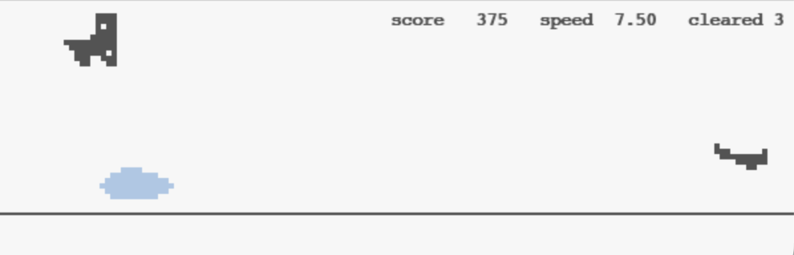
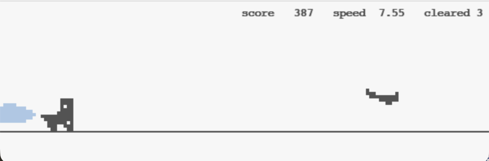

# Dinosaur Agent: Classical vs Deep Learning

We built two agents that play Chrome Dino, one based on hand-coded rules and one based on a learned model, and compared how they perform on the same game.


## Table of Contents

1. [What is Chrome Dino](#what-is-chrome-dino)
2. [The Cloud Challenge](#the-cloud-challenge)
3. [Classical Approach](#1-classical-approach)
   - [Method](#method)
   - [What we built](#what-we-built)
   - [Why it matters](#why-it-matters)
   - [Decisions we made](#decisions-we-made)
4. [Deep Learning Approach](#2-deep-learning-approach)
   - [Method](#method-1)
   - [What we built](#what-we-built-1)
   - [Why it matters](#why-it-matters-1)
   - [Decisions we made](#decisions-we-made-1)
5. [Evaluation Strategy](#evaluation-strategy)
6. [Results](#results)
7. [Repository Layout](#repository-layout)
8. [How to Run](#how-to-run)
9. [Team](#team)


## What is Chrome Dino

Chrome Dino is the offline mini-game built into Google Chrome. A pixel-art dinosaur runs to the right. The player jumps over cacti that come from the right edge and ducks under pterodactyls that fly across. The game speed continuously increases, so reactions have to get faster as the run goes on. The score is how long the dinosaur survives.

We built a Pygame clone of Chrome Dino and put two agents in front of it. The agents read each frame, decide whether to jump, duck, or do nothing, and send that action back. Both use the same interface to the game, so the only real difference between them is how they perceive what they see.


## The Cloud Challenge

To make the comparison between the two agents meaningful, we added light-blue cloud decoys to the game. Clouds drift across the screen at random heights. They do not hurt the dinosaur, they pass right through it, but the dinosaur does not know that. The agent has to figure out for itself whether a shape on screen is a real obstacle or just a harmless cloud.



A rule-based agent cannot tell the difference. Its perception finds dark pixels and groups them into shapes. A cloud is a dark shape. A cactus is a dark shape. They look identical to a brightness threshold. So the classical agent jumps on every cloud even though clouds are harmless, wastes 35 airborne frames (the full jump duration), and very often lands on the real cactus that arrives during those frames. The screenshot above catches it mid-jump over a harmless cloud with a pterodactyl already approaching from the right.



A learned agent sees the same shapes but classifies them by what they look like, not just whether they are dark. It learned from training examples that clouds are a separate class and do not require action. So it stays on the ground and runs through them, as the screenshot above shows.

You could patch the classical agent. For example, add a rule "if the dark blob is more than 40 pixels wide, ignore it". That fixes this specific cloud. Change the cloud's size, color, or shape and the rule breaks and you write another rule. Add a new kind of obstacle and you write another. The learned model generalizes from examples without new rules. That difference between rules that break on new inputs and learned models that generalize is the whole point of this project.


## 1. Classical Approach

### Method

Classical computer vision. Find dark pixels, group them into shapes, classify each shape by its position on screen, and act based on a hand-tuned rule.

### What we built

Everything classical lives under the `classical/` folder.

- `classical/perception.py`
  - Crops the area in front of the dinosaur.
  - Converts to grayscale.
  - Thresholds any pixel darker than grayscale 220 as "on".
  - Runs OpenCV `findContours` to detect connected dark blobs.
  - For each blob, reads the bottom Y position: near the ground line is classified as cactus, higher is classified as pterodactyl.
  - Returns the nearest blob in front of the dinosaur as `{present, distance, type, height}`.

- `classical/planner.py`
  - Takes the classified obstacle and the current game speed.
  - Returns `jump`, `duck`, or `none`.
  - Rule: if the obstacle is within `70 + 2.0 * game_speed` pixels, jump on a cactus or a low pterodactyl, duck on a high pterodactyl, otherwise do nothing.

### Why it matters

Classical CV is the right starting point. It has no training data, no model weights, and no moving parts. If hand-coded rules are enough to play the game, you do not need a neural network. It also sets a clear bar for the DL version to clear: any score difference has to come from something rules cannot do.

### Decisions we made

- **Fixed threshold instead of adaptive.** Grayscale cutoff of 220 picks up both real obstacles and the light-blue clouds. Adaptive thresholding (Otsu, adaptive mean) would handle varying brightness but adds complexity that this game's uniform background does not need.
- **Classify by position, not shape.** Contour bottom near the ground line means cactus; higher means pterodactyl. This avoids any shape classifier and keeps the pipeline purely geometric. It also means classical cannot distinguish clouds from cacti, which is the failure mode we want to measure.
- **Dino self-filter.** The dinosaur lives inside the perception crop on purpose, so we can still see obstacles flying over it. We filter the dinosaur's own contour by checking that a ground-touching blob falls inside a known x-band (45 to 95).
- **Linear reaction distance.** `reaction_distance = base + speed_factor * game_speed`. We deliberately picked a tight `speed_factor` of 2.0 so the agent runs out of reaction margin at high game speeds. This keeps a real, categorizable failure mode visible in the evaluation. Raising the factor removes it but hides the planner's limit.


## 2. Deep Learning Approach

### Method

A two-stage cascade. First, the same contour detection from classical finds candidate shapes. Second, a small convolutional neural network classifies each shape as cactus, pterodactyl, or cloud. Clouds are discarded. The nearest non-cloud shape is returned.

### What we built

Everything DL lives under the `dl/` folder.

- `dl/perception.py`
  - Runs the classical contour detection to find candidate bounding boxes.
  - Passes each 32x32 grayscale patch through the CNN.
  - Suppresses anything the CNN labels as a cloud.
  - Returns the nearest real obstacle.

- `dl/model.py`
  - CNN architecture: three convolution blocks (Conv + BatchNorm + ReLU + MaxPool), then a classifier head (flatten, linear 128, Dropout 0.3, linear 3).
  - Input: a 32x32 grayscale patch.
  - Output: three class scores for cactus, pterodactyl, and cloud.

- `dl/train.py`
  - Runs the classical agent on 80 seeded episodes to collect training data.
  - Labels each contour bounding box by matching it against the game's ground-truth obstacle list (IoU match).
  - Trains the CNN for 30 epochs with Adam, cosine learning-rate schedule, class oversampling, and horizontal flip + brightness augmentation.
  - Saves the best validation checkpoint to `dl/weights/cnn.pt`.
  - The last run collected 75,275 labeled patches and reached 100 percent validation accuracy.

- `dl/planner.py`
  - Unchanged from classical. Only perception is learned.

### Why it matters

Classical cannot distinguish shapes that look similar but mean different things (cloud versus cactus). A learned classifier can. Even a tiny CNN trained on a few tens of thousands of patches nearly eliminates the cloud confusion that dominates classical's failures. Once the scene contains semantic ambiguity, rule-based perception hits a ceiling that learning clears without a redesign.

### Decisions we made

- **Classifier cascade instead of end-to-end detector.** The CNN only classifies bboxes that classical already proposed. This keeps the model tiny, easy to train, and interpretable (you can look at any classified crop and see what the CNN decided). The tradeoff is that if classical contour detection misses an obstacle, the CNN never sees it.
- **Three positive classes, not two plus "nothing".** Cactus, pterodactyl, cloud. Treating cloud as a named class makes the decision boundary sharper and the training objective cleaner than a "real obstacle vs no obstacle" binary.
- **Supervised labels from the game's ground truth.** The game knows what it spawned and tags each obstacle with its type. The training script matches each detected bounding box against these, so no hand-labeling was needed.
- **Same planner as classical.** We only replaced perception. This keeps the comparison fair: any score difference between the two agents is attributable to perception, not to a better policy on top.
- **Small CNN.** Three convolution blocks is plenty for a three-class problem where the classes are this visually distinct. A larger model would train slower and give nothing back on this data.


## Evaluation Strategy

We designed the evaluation so that any score difference between the two agents comes only from the part we changed (perception). Everything else is identical across runs.

### What we held constant

- **Same game code.** Both agents play the same Pygame clone, with the same physics, sprites, obstacle spawn distribution, and speed curve.
- **Same seed list.** 100 episodes using the cohort pattern `[1..5]` rotated 20 times, so both agents see the same obstacle order on every matching seed.
- **Same planner.** The rule-based `classical/planner.py` is called by both agents. Only perception differs.
- **Same frame cap.** Every episode stops at 10,000 frames if the agent has not already died. This keeps runs bounded and makes "reached the cap" a meaningful survival threshold.

### What we measure

For each episode we record the score (frames survived), obstacles cleared, final game speed, and frame-by-frame actions and detections. Across 100 episodes we then compute:

- **Score distribution.** Mean, median, standard deviation, min/max, and percentile breakdowns. Median is more informative than mean because the distributions are long-tailed.
- **Survival thresholds.** Percent of runs reaching 1,000 frames, 5,000 frames, and the 10,000 cap. Lets us talk about consistency and not just peak score.
- **Death cause.** What killed the agent: cactus or pterodactyl. A shift in the mix between classical and DL tells us which failure mode each approach fixed.
- **Per-frame latency.** Average milliseconds spent in perception and in planning, so a faster score is not actually due to a slower pipeline running inside a fixed-time game.

### Failure buckets

`eval/failure_analysis.py` reads every logged run and assigns each death to one of five categories. This is the key diagnostic for "why did the agent fail?" rather than just "how many frames did it last?".

- **survived.** Reached the 10,000-frame cap without dying.
- **missed_detection.** A real obstacle was on screen but perception reported nothing. The agent had no chance to react.
- **misclassification.** Perception saw an obstacle but labeled its type wrong. Classical suffers this most from clouds (tagged as cacti).
- **late_reaction.** Perception found the obstacle only when it was already very close, leaving the planner no time to act.
- **timing_error.** Perception and classification were both correct, the agent acted, but still collided (usually because the reaction distance was tight at high game speed).

### How to reproduce

Every eval run is deterministic. Given the same code, the same seed, and the same config, you get the exact same score. The commands in [How to Run](#how-to-run) produce the numbers in the results table below, bit-for-bit. The per-episode JSON logs in `eval/runs/` are the raw evidence; `eval/summary_100.txt` and `eval/summary_100_dl.txt` aggregate them.


## Results

We ran both agents on 100 episodes using the same random seeds, so each agent saw the same obstacles in the same order. The only thing we changed between runs was the perception module.

| Metric | Classical | DL |
|---|---|---|
| Mean score | 2,511 | 4,869 |
| Median score | 1,302 | 5,253 |
| Runs reaching 5,000 frames | 16% | 50% |
| Cloud misclassification (fraction of failures) | 57% | 4% |

DL scored about twice as high on average and four times as high at the median. The classical agent's main failure, mistaking clouds for obstacles, is almost fully solved by the CNN. DL perception is slower to run per frame than classical, but both are fast enough to keep up with the game in real time.

Full per-run numbers are in `eval/summary_100.txt` (classical) and `eval/summary_100_dl.txt` (DL). Failure breakdowns are produced by `eval/failure_analysis.py`.


## Repository Layout

```
.
├── main.py                        # entry point, plays one or more episodes; --impl classical or --impl dl
├── requirements.txt
├── classical/
│   ├── perception.py              # threshold, contours, geometric classification
│   └── planner.py                 # rule-based planner (jump / duck / none)
├── dl/
│   ├── perception.py              # contour proposals, CNN classifies each patch
│   ├── planner.py                 # delegates to classical (perception-only replacement)
│   ├── model.py                   # CNN architecture (3-class classifier)
│   ├── train.py                   # data collection + training, produces dl/weights/cnn.pt
│   └── weights/cnn.pt             # trained CNN weights
├── app/
│   ├── game.py                    # Pygame clone of Chrome Dino with cloud decoys
│   ├── controller.py              # action dispatcher
│   └── config.yaml                # all thresholds, crop region, eval settings
├── eval/
│   ├── run_eval.py                # batch 100-episode runner
│   ├── failure_analysis.py        # classify deaths into 5 buckets
│   ├── summary_100.txt            # classical 100-episode results
│   └── summary_100_dl.txt         # DL 100-episode results
├── DL_INTERFACE.md                # frozen contract both implementations obey
├── TODO_DL.md                     # DL implementation notes
└── README.md
```

Classical and DL code are in sibling folders, so each approach is self-contained and easy to find. The `app/` folder holds everything the agents do not decide: the game engine, the sprite rendering, the collision physics, the action dispatcher, and the shared configuration file. Agents import `Game` from here but do not edit it. The `eval/` folder runs both agents on the same seeds and produces comparable numbers. `DL_INTERFACE.md` documents the function signatures both `classical/` and `dl/` modules must obey; that contract is what lets `--impl` swap between them.


## How to Run

Install dependencies once:

```bash
pip install -r requirements.txt
```

Watch one episode in a window:

```bash
python main.py --impl classical --seed 1     # rule-based agent, jumps on clouds
python main.py --impl dl --seed 1            # learned agent, runs through clouds
```

Run the full 100-episode evaluation:

```bash
python eval/run_eval.py --impl classical --episodes 100
python eval/run_eval.py --impl dl --episodes 100
python eval/failure_analysis.py
```

Retrain the DL model from scratch:

```bash
python dl/train.py
```

The script collects fresh training data by running the classical agent on 80 seeded episodes, trains the CNN, and saves the new weights to `dl/weights/cnn.pt`. It does not touch anything else.


## Team

Vihaan Manchanda, Anvita Suresh
