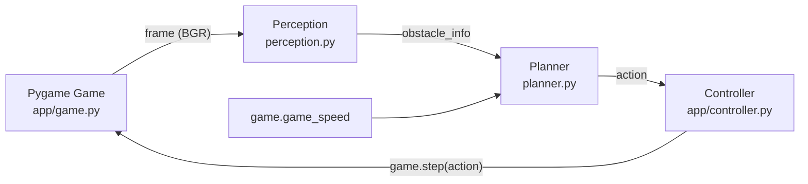
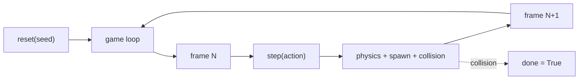
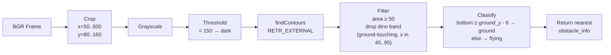

# Chrome Dino Agent: Classical Perception and Planning

Can a hand-tuned classical pipeline play Chrome Dino at high speeds, and where does it break?

Chrome Dino is a reactive obstacle-avoidance game where a running character must jump over cacti and duck under pterodactyls while the game speed continuously increases. Classical computer vision — fixed thresholds, contour detection, and rule-based control — is fast and interpretable but sensitive to hand-picked decision boundaries. We build a perception → planner → controller agent on a self-contained Pygame clone, detect obstacles with contours on a cropped frame, select actions with a stateless rule, and evaluate on 100 seeded deterministic episodes.

On the evaluation set, the agent survives every run past frame 5,000 with a mean score of 8,241 (median 8,354, stdev 455). Perception takes 15 μs per frame; planning is effectively free. All 100 deaths are timing errors on cacti at game speeds 36–44, the regime where the linear reaction-distance formula fails.


## Repository Structure

```
.
├── main.py                      # watch / batch game loop entry point
├── perception.py                # contour-based obstacle detector
├── planner.py                   # stateless jump / duck / none decision
├── requirements.txt
├── app/
│   ├── game.py                  # ~265-line Pygame clone with pixel sprites
│   ├── controller.py            # action dispatcher
│   └── config.yaml              # all thresholds, crop region, eval settings
├── eval/
│   ├── run_eval.py              # batch seeded episodes, per-run JSON logs, summary stats
│   ├── failure_analysis.py      # categorize deaths into 5 buckets
│   ├── summary_100.txt          # latest 100-run summary (tracked)
│   └── runs/                    # per-episode JSON logs (gitignored)
├── DL_INTERFACE.md              # contract for the DL partner's repo
├── TODO_DL.md                   # partner handoff checklist
└── README.md
```


## How to Run

Install dependencies:

```bash
pip install -r requirements.txt
```

Watch the agent play one episode:

```bash
python main.py                         # window + HUD (score / speed / cleared)
python main.py --seed 1                # deterministic run
python main.py --episodes 5            # five back-to-back in the window
```

Batch mode, no window, no FPS cap:

```bash
python main.py --no-render --fast --episodes 100
```

Full eval pipeline:

```bash
python eval/run_eval.py --episodes 100     # seeded runs, logs + summary
python eval/failure_analysis.py            # categorize deaths in eval/runs/
```


## Overall Architecture



Each frame runs the full pipeline: perception consumes a 600×200 BGR numpy array, the planner reads the detected obstacle plus the current game speed and emits one of `{none, jump, duck}`, and the controller forwards the action to the game. No OS keystrokes, no browser, no learned parameters.


## Game

We built a self-contained Pygame clone (`app/game.py`) rather than screen-scraping the real Chrome Dino or forking an existing repo. The agent interacts with it through a direct Python API (`step`, `reset`, `get_frame`, and `score`, `done`, `game_speed` attributes), which makes perception fast and evaluation deterministic.



Obstacles spawn with a seeded RNG at 55–140 frame intervals, move leftward at the current game speed, and are removed when fully off-screen. Sprites are pixel-art silhouettes composed from ASCII grids at 4× scale (two-frame running animation for the dino, two-frame wing flap for the pterodactyl, ducking pose for low flyers).

| Parameter | Value | Purpose |
|---|---|---|
| `screen_w`, `screen_h` | 600, 200 | frame size |
| `ground_y` | 160 | ground line Y |
| `dino_x`, `dino_w` | 50, 40 | dino position and width |
| `dino_h_stand`, `dino_h_duck` | 40, 20 | standing vs ducking height |
| `gravity`, `jump_v` | 0.8, −14.0 | vertical physics |
| `start_speed`, `speed_inc` | 6.0, 0.004 | initial + per-frame speed increase |
| `spawn_min_gap`, `spawn_max_gap` | 55, 140 | frames between obstacle spawns |
| `cactus_w`, `cactus_h` | 20, 40 | ground obstacle |
| `ptero_w`, `ptero_h` | 40, 20 | flying obstacle |
| `ptero_high_y`, `ptero_low_y` | 108, 135 | must-duck / must-jump heights |


## Perception



`perception.detect(frame, cfg)` returns a dict `{present, distance, type, height}` describing the nearest obstacle ahead of the dino. Distance is measured from the dino's right edge (x = 90). Distance can be negative when an obstacle is horizontally overlapping the dino — this happens when a pterodactyl passes above a ducking dino, and keeps the planner in `duck` until the threat clears.

The dino itself is inside the crop region (so we can still see obstacles over it), so we filter its contour out by checking that the contour touches the ground AND falls inside the dino's known x-band.

| Config Key | Value | Role |
|---|---|---|
| `crop_x_start`, `crop_x_end` | 50, 500 | horizontal extent of the scan region |
| `crop_y_start`, `crop_y_end` | 80, 160 | vertical extent (excludes ground line) |
| `threshold` | 150 | grayscale cutoff for dark pixels |
| `min_contour_area` | 50 | noise filter (cactus area = 800, ptero = 800) |
| `ground_line_y`, `ground_tolerance` | 160, 6 | contour bottom ≥ 154 → ground obstacle |
| `dino_right_edge` | 90 | reference point for distance |
| `dino_mask_x_start`, `dino_mask_x_end` | 45, 95 | band used to filter the dino's own contour |


## Planner

The planner is stateless. It receives the obstacle info, the current game speed, and the config, and returns an action.

| Obstacle | Height (top-Y) | Distance | Action |
|---|---|---|---|
| none | — | — | `none` |
| ground (cactus) | — | > `reaction_distance` | `none` |
| ground (cactus) | — | ≤ `reaction_distance` | `jump` |
| flying (ptero) | > `duck_height_threshold` (too low) | ≤ `reaction_distance` | `jump` |
| flying (ptero) | ≤ `duck_height_threshold` (high enough) | ≤ `reaction_distance` | `duck` |

`reaction_distance = base_reaction_distance + speed_factor × game_speed`

| Config Key | Value | Role |
|---|---|---|
| `base_reaction_distance` | 70 | distance at game_speed = 0 |
| `speed_factor` | 2.0 | linear scaling with game speed |
| `duck_height_threshold` | 125 | flying obstacles with top-Y above this are duckable |

A pterodactyl at `ptero_high_y = 108` passes over a ducking dino (bottom at Y=128, ducking dino top at Y=140) — the planner ducks. A pterodactyl at `ptero_low_y = 135` collides with both standing and ducking dino — the planner jumps.


## Evaluation Protocol

All 100 episodes are deterministic: the game uses a seeded `random.Random`, the agent reads the rendered frame through `surfarray`, and perception and planner are pure functions. Given seed N, the same score is produced every time. The DL partner's repo will use the same seed list and the same `app/config.yaml` schema — any DL-specific keys live under a `dl:` namespace so the eval harness is shared across implementations.

| Parameter | Value |
|---|---|
| Episodes | 100 |
| Seeds | rotated through `[1, 2, 3, 4, 5]` for 20 cohorts |
| Max frames per episode | 10,000 (frame cap prevents infinite runs when the agent is too good for the difficulty) |
| Headless | yes (pygame dummy video driver) |
| Fast mode | yes (no FPS cap) |

Each episode writes a JSON log to `eval/runs/run_<impl>_<seed>_<i>.json` with the frame-by-frame action, obstacle info, dino state, and raw obstacles list. `failure_analysis.py` reads those logs and categorizes each death into one of five buckets: `survived`, `missed_detection`, `misclassification`, `late_reaction`, `timing_error`.


## Results

### Score and survival

| Metric | Mean | Median | Min | Max | Stdev |
|---|---|---|---|---|---|
| Score (frames survived) | 8,241.5 | 8,354 | 7,616 | 9,441 | 454.6 |
| Obstacles cleared | 83.6 | 84 | 72 | 98 | 5.4 |
| Final game speed | 38.97 | — | 36.46 | 43.76 | — |

| Score percentile | p10 | p25 | p50 | p75 | p90 | p95 |
|---|---|---|---|---|---|---|
| Value | 7,631 | 7,654 | 8,354 | 8,425 | 8,494 | 9,259 |

| Threshold | % runs reaching |
|---|---|
| 1,000 frames | 100.0% |
| 5,000 frames | 100.0% |
| 10,000 frames (cap) | 0.0% |

### Death cause

| Type | Count | Fraction |
|---|---|---|
| Ground (cactus) | 100 | 100.0% |
| Flying (pterodactyl) | 0 | 0.0% |

### Failure analysis

| Category | Count | Fraction |
|---|---|---|
| survived | 0 | 0.0% |
| missed_detection | 0 | 0.0% |
| misclassification | 0 | 0.0% |
| late_reaction | 0 | 0.0% |
| timing_error | 100 | 100.0% |

### Per-frame latency

| Stage | Time |
|---|---|
| Perception | 0.015 ms/frame (≈ 15 μs) |
| Planning | < 0.001 ms/frame |


## Why the agent plateaus

Deaths cluster at three specific game-speed cliffs. Because the obstacle sequence is deterministic per seed, each seed's fatal cactus arrives at roughly the speed where the planner's reaction-distance formula first becomes insufficient.

| Death-speed cohort | Runs | Typical score |
|---|---|---|
| 36–37 | 29 | 7,616–7,659 |
| 39–40 | 63 | 8,320–8,495 |
| 42–44 | 8 | 9,146–9,441 |

At game speed `S`, the planner triggers a jump when `distance ≤ 70 + 2.0 × S`. At `S = 36.5` that reaction distance is 143 pixels, but obstacles move 36.5 pixels per frame — so distance steps from ~145 (no jump) to ~109 (jump) in a single frame, and the jump fires one frame too late to clear the cactus. The perception pipeline handles the scene correctly in every one of these cases: 0 missed detections, 0 misclassifications across 100 runs.

The fix is a config tweak, not a code change: raising `planner.speed_factor` from `2.0` to roughly `4.0–6.0` pushes the jump-trigger distance past the single-frame displacement at those speeds. We intentionally leave the value tight so the eval exhibits a nonzero, categorized failure mode — a flat 100% cap-reach would tell us nothing about where the classical approach runs out of road.

This is the point of comparison for the DL partner's repo: if a learned agent handles the speed-scaling problem without per-threshold tuning, that is the contribution.


## DL Handoff

The DL version lives in a separate repo and shares this repo's eval harness through two frozen function signatures in `DL_INTERFACE.md`. Either module may be replaced; both may be replaced; neither may change keys outside its `dl:` config namespace.

```
detect(frame, cfg) -> {present, distance, type, height}
decide(obstacle_info, game_speed, cfg) -> {'none', 'jump', 'duck'}
```

Concrete partner checklist lives in `TODO_DL.md`. Both implementations must run on the same seeds and the same `max_frames` cap — the write-up compares score distribution, death cause, failure categorization, and per-frame latency head to head.


## Team

Vihaan Manchanda (classical), Anvita Suresh (DL)

IDS 705, Duke University


## References

- Project specification: `CLAUDE.md` at repository root.
- DL interface: `DL_INTERFACE.md`.
- Partner handoff: `TODO_DL.md`.
